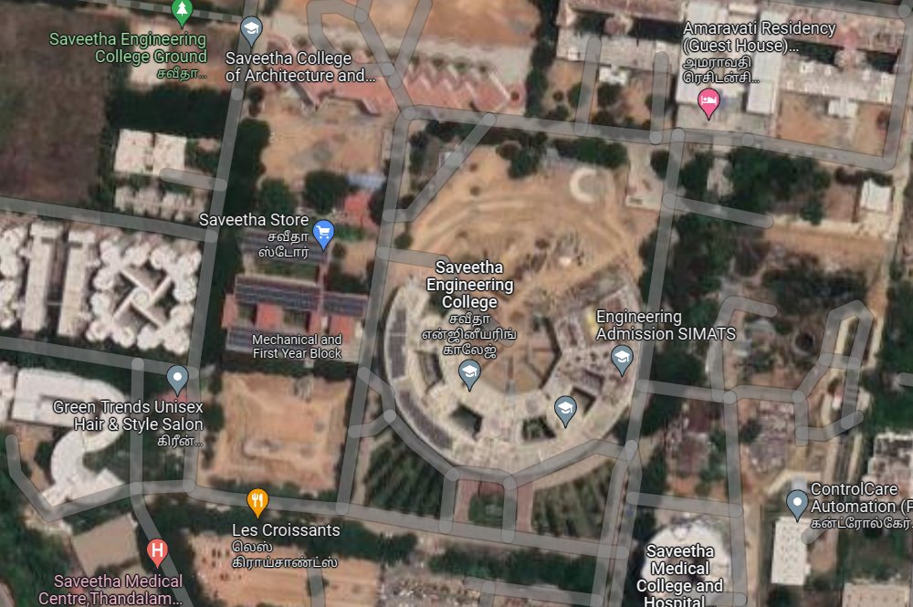
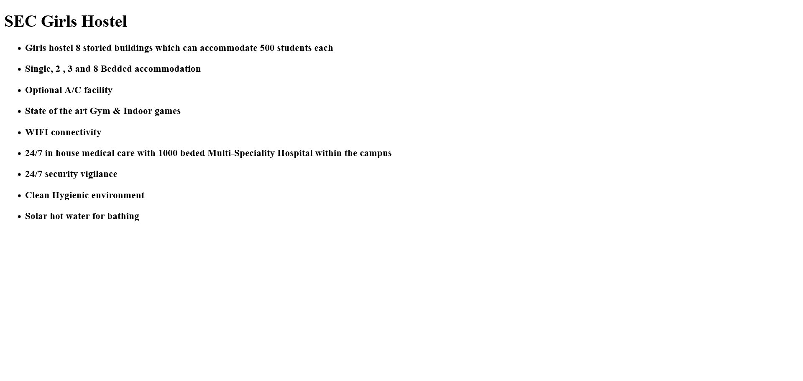
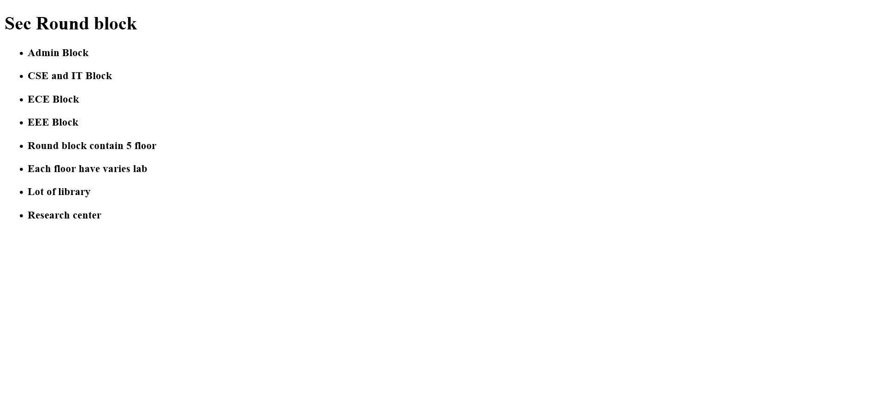
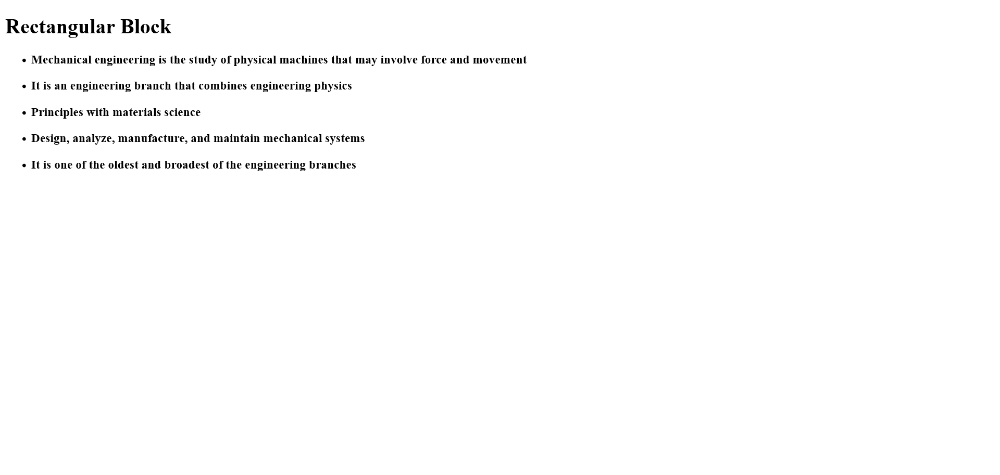
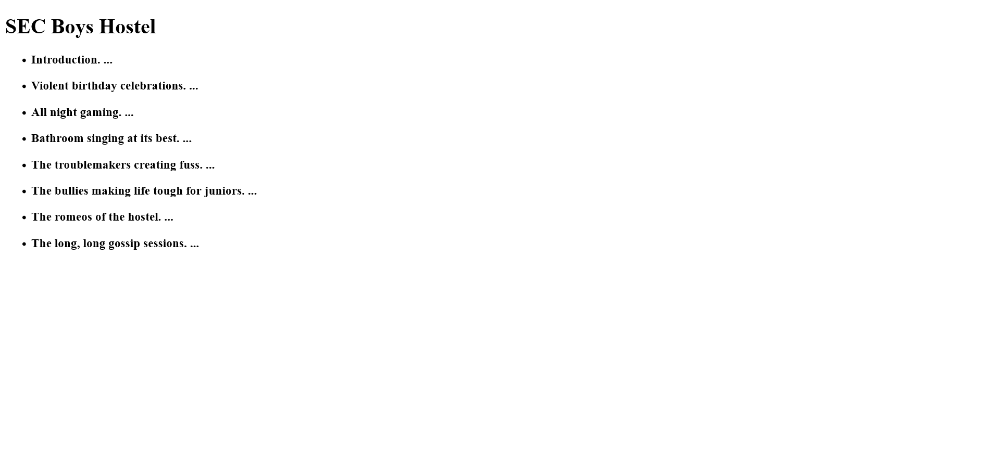
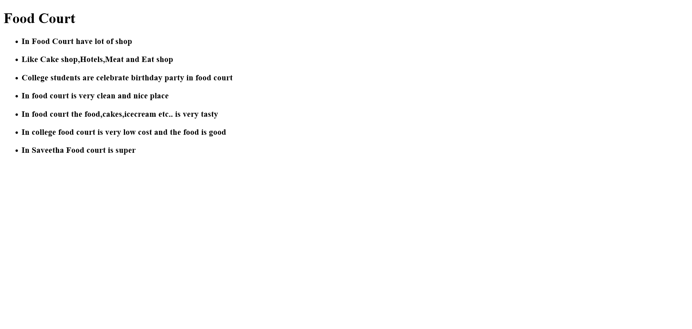
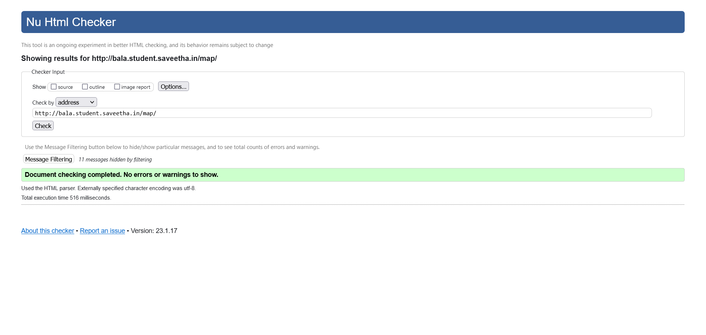

# Places Around Me
## AIM:
To develop a website to display details about the places around my house.

## Design Steps:

### Step 1:

Clone the git repository into Theia IDE

### Step 2:

Create a new Django project.

### Step 3:

Write the needed HTML code.

### Step 4:

Run the Django server and execute the HTML files.

## Code:

MAP CODE:

```
<!DOCTYPE html>
<html lang="en">
    <head>
        <title>My City</title>
    </head>
    <body>
        <h1 align="center"><font color="red"><b>SAVEETHA ENGINEERING COLLEGE</b></font></h1>
        <h3 align="center"><font color="blue"><b>BALA R (22001925)</b></font></h3>
        <center>
        
        <map name="MyCity">
        <area shape="circle" coords="1150,10,90" href="/static/html/one.html" title="Girls Hostel">
        <area shape="circle" coords="700,305,165" href="/static/html/two.html" title="Round Block">
        <area shape="circle" coords="395,330,53" href="/static/html/three.html" title="Rectangular Block">
        <area shape="circle" coords="800,10,50" href="/static/html/four.html" title="Boys Hostel">
        <area shape="circle" coords="395,530,60" href="/static/html/five.html" title="Food Court">
        </map>
        </center>
    </body>
</html>
```

OUTPUT 1 CODE:

```
<!DOCTYPE html>
<html>
    <head>
        <title>SEC Girls Hostel</title>

    </head>
    <body>
        <h1>SEC Girls Hostel</h1>
        <ul>
            <li><h3>Girls hostel 8 storied buildings which can accommodate 500 students each</h3></li>
            <li><h3>Single, 2 , 3 and 8 Bedded accommodation</h3></li>
            <li><h3>Optional A/C facility</h3></li>
            <li><h3>State of the art Gym & Indoor games</h3></li>
            <li><h3>WIFI connectivity</h3></li>
            <li><h3>24/7 in house medical care with 1000 beded Multi-Speciality Hospital within the campus</h3></li>
            <li><h3>24/7 security vigilance</h3></li>
            <li><h3>Clean Hygienic environment</h3></li>
            <li><h3>Solar hot water for bathing</h3></li>
        </ul>
    </body>
</html>
```

OUTPUT 2 CODE:

```
<!DOCTYPE html>
<html>
    <head>
        <title>Round Block</title>
    </head>
    <body>
        <h1>Sec Round block</h1>
        <ul>
            <li><h3>Admin Block</h3></li>
            <li><h3>CSE and IT Block</h3></li>
            <li><h3>ECE Block</h3></li>
            <li><h3>EEE Block</li>
            <li><h3>Round block contain 5 floor</h3></li>
            <li><h3>Each floor have varies lab</h3></li>
            <li><h3>Lot of library</h3></li>
            <li><h3>Research center</h3></li>
        </ul>
    </body>
</html>
```

OUTPUT 3 CODE:

```
<!DOCTYPE html>
<html>
    <head>
        <title>Rectangular Block</title>
    </head>
    <body>
        <h1>Rectangular Block</h1>
        <ul>
            <li><h3>Mechanical engineering is the study of physical machines that may involve force and movement</h3></li>
            <li><h3>It is an engineering branch that combines engineering physics</h3></li>
            <li><h3>Principles with materials science</h3></li>
            <li><h3>Design, analyze, manufacture, and maintain mechanical systems</h3></li>
            <li><h3>It is one of the oldest and broadest of the engineering branches</h3></li>
        </ul>
    </body>
</html>
```

OUTPUT 4 CODE:

```
<!DOCTYPE html>
<html>
    <head>
        <title>SEC Boys Hostel</title>
    </head>
    <body>
        <h1>SEC Boys Hostel</h1>
        <ul>
            <li><h3>Introduction. ...</h3></li>
            <li><h3>Violent birthday celebrations. ...</h3></li>
            <li><h3>All night gaming. ...</h3></li>
            <li><h3>Bathroom singing at its best. ...</h3></li>
            <li><h3>The troublemakers creating fuss. ...</h3></li>
            <li><h3>The bullies making life tough for juniors. ...</h3></li>
            <li><h3>The romeos of the hostel. ...</h3></li>
            <li><h3>The long, long gossip sessions. ...</h3></li>
        </ul>
    </body>
</html>
```

OUTPUT 5 CODE:

```
<!DOCTYPE html>
<html>
    <head>
        <title>Food Court</title>

    </head>
    <body>
        <h1>Food Court</h1>
        <ul>
            <li><h3>In Food Court have lot of shop</h3></li>
            <li><h3>Like Cake shop,Hotels,Meat and Eat shop</h3></li>
            <li><h3>College students are celebrate birthday party in food court</h3></li>
            <li><h3>In food court is very clean and nice place</h3></li>
            <li><h3>In food court the food,cakes,icecream etc.. is very tasty</h3></li>
            <li><h3>In college food court is very low cost and the food is good</h3></li>
            <li><h3>In Saveetha Food court is super</h3></li>
        </ul>
    </body>
</html>
```

## Output:













### Validation:



## Result:

Thus The Web Is Developed To Show The Details Of SEC